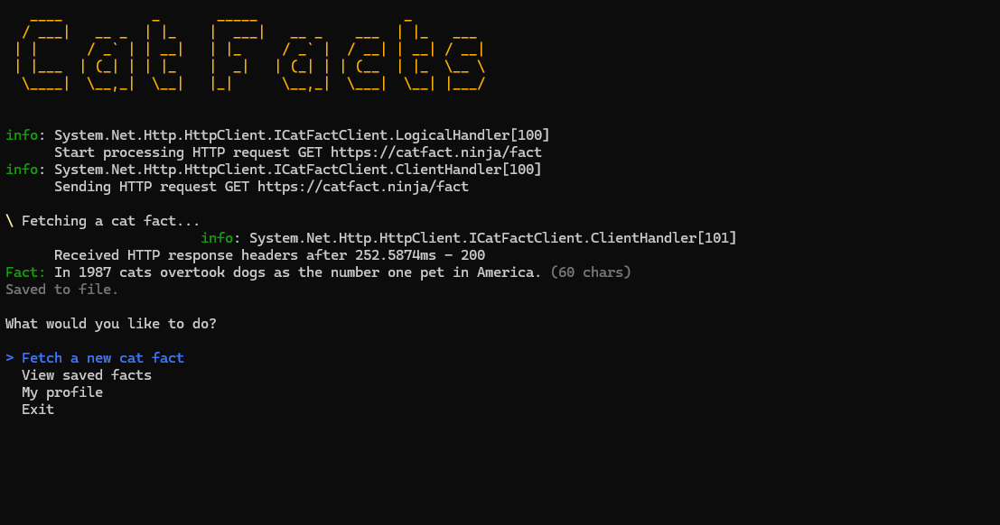
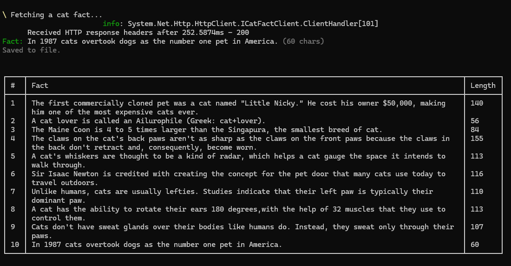
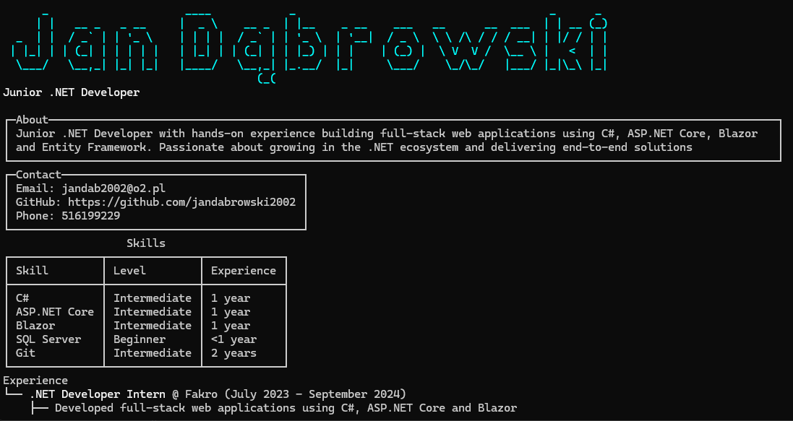

[English version](README.md)

# Cat Fact Logger

Aplikacja konsolowa w .NET 10 stworzona jako zadanie rekrutacyjne dla NETWISE. Łączy się z
[Cat Facts API](https://catfact.ninja/fact), zapisuje każdą odpowiedź jako nową
linię w lokalnym pliku `.txt`, a dodatkowo zawiera ekran "Moje CV".


*Menu główne*


*Pobieranie i zapisywanie faktu o kocie*


*Ekran "Moje CV"*

## Co robi aplikacja

- **Pobierz nowy fakt o kotach** — wywołuje `GET https://catfact.ninja/fact`,
  wyświetla wynik i dopisuje go jako jedną linię JSON do pliku `cat-facts.txt`
  **na pulpicie aktualnego użytkownika**. Plik jest tworzony automatycznie przy
  pierwszym zapisie, więc działa tak samo dla każdego, kto uruchomi aplikację,
  na dowolnym komputerze.
- **Pokaż zapisane fakty** — odczytuje `cat-facts.txt` i wyświetla go w formie
  tabeli.
- **Moje CV** — renderuje moje CV (z pliku `profile.json`) jako panele, tabelę
  umiejętności i drzewo doświadczenia, przy użyciu
  [Spectre.Console](https://spectreconsole.net/).

## Wymagania

- .NET 10 SDK

## Uruchamianie

### Visual Studio
Otwórz `CatFactLogger.sln`, ustaw `CatFactLogger` (w folderze `src`) jako
projekt startowy i uruchom (F5 / Ctrl+F5).

### Wiersz poleceń
```
dotnet run --project src/CatFactLogger
```

### Uruchamianie testów
```
dotnet test
```

## Struktura projektu

```
src/CatFactLogger/
  Models/            CatFact, ProfileModel i powiązane DTO
  Options/           Silnie typowana konfiguracja (CatFactOptions, ProfileOptions)
  Services/          ICatFactClient / CatFactClient, IFactStorage / FileFactStorage,
                      IProfileProvider / JsonProfileProvider, IProfileRenderer / SpectreProfileRenderer
  ConsoleMenu.cs     Obsługuje interaktywne menu; zależy wyłącznie od interfejsów
  Program.cs         Punkt kompozycji: buduje hosta, konfiguruje DI
  appsettings.json   Adres API, ścieżka pliku wynikowego, ścieżka pliku profilu
  profile.json       Treść mojego CV, wyświetlana na ekranie profilu

tests/CatFactLogger.Tests/
  CatFactClientTests.cs      Klient HTTP testowany za pomocą fałszywego HttpMessageHandler (bez realnych wywołań sieciowych)
  FileFactStorageTests.cs    Zapis do pliku testowany na plikach tymczasowych
```

## Dlaczego tak

- **Dependency Injection** przez .NET Generic Host (`Host.CreateApplicationBuilder`).
  Każdy serwis ukryty jest za interfejsem (`ICatFactClient`, `IFactStorage`,
  `IProfileProvider`, `IProfileRenderer`) i rejestrowany w `Program.cs`.
- **`HttpClient` przez `AddHttpClient`**, a nie `new HttpClient()`, dzięki czemu
  połączenia są prawidłowo poolowane, a timeout skonfigurowany centralnie.
- **Konfiguracja zamiast hardkodowania**: adres API, ścieżka pliku wynikowego i
  ścieżka pliku profilu znajdują się w `appsettings.json` i są mapowane na
  silnie typowane klasy opcji (options pattern), zamiast być zapisane na
  sztywno w kodzie. Względna `OutputFilePath` (wartość domyślna) jest
  rozwiązywana względem pulpitu aktualnego użytkownika w czasie działania
  (`Environment.SpecialFolder.Desktop`), więc ta sama konfiguracja działa na
  dowolnym komputerze; ścieżka bezwzględna w konfiguracji nadpisuje to
  zachowanie.
- **Obsługa błędów**: błędy sieciowe, kody statusu HTTP inne niż sukces oraz
  niepoprawny JSON są przechwytywane i logowane; aplikacja wyświetla
  przyjazny komunikat i działa dalej zamiast się crashować.
- **Separacja odpowiedzialności**: pobieranie danych, zapisywanie danych,
  wczytywanie danych profilu i renderowanie profilu to osobne, niezależnie
  testowalne serwisy. `ConsoleMenu` jedynie nimi zarządza.

## O mnie

Zobacz opcję "Moje CV" w aplikacji lub bezpośrednio plik
`src/CatFactLogger/profile.json`.
